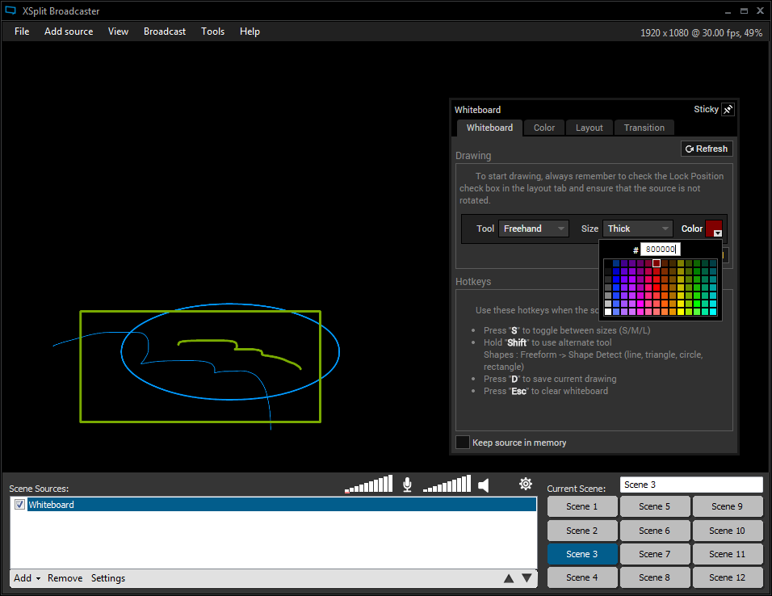
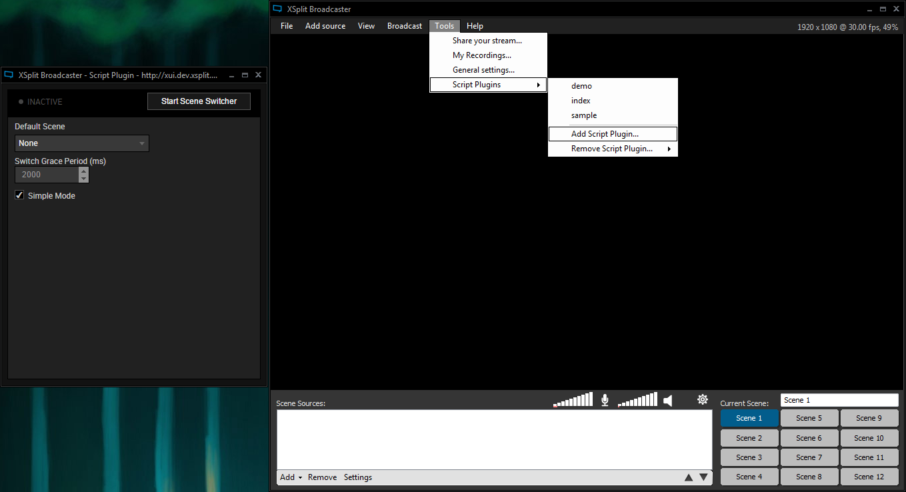

# Getting Started

1. [Types of Plugins](#types)
2. [Getting started with development](#start)
3. [Developing source plugins](#source)
4. [Developing script plugins](#script)

## <a name="types"></a> Types of Plugins

Using the framework, developers can create two types of plugins: source plugins and global script plugins. Source plugins are added to the stage in a specific scene to be captured in a recording or a live stream, while script plugins exist within their own window, and are capable of manipulating the entire application and the whole set of scenes the user is working with. 

Figure 1. A Source Plugin 



Figure 1 shows an example of a source plugin, the Whiteboard, and its corresponding configuration window. A source plugin is developed in HTML, and is composed of two parts: the source/base HTML and the configuration HTML. The framework provides utilities to allow communication between the base and the configuration. For more information on developing these, please read [Source Plugins](develop-source.md#source) and [Developing the configuration Window](develop-source.md#configWindow) for more details.

Figure 2. A Global Script Plugin 



Figure 2 shows an example of a global script plugin (currently in development). Script plugins are powerful tools that are able to access more functions than a single source plugin can. They can manipulate scenes, switch between them, and even add new objects to the active scene. More information can be found at [Developing Script Plugins](#script).

## <a name="start"></a> Getting started with development

All plugins of all types (source and script plugins) should import `xui.js` in order to work correctly. This is a library containing all the methods of the XUI plugin framework that may be used to develop any type of plugin. **Important note:** All plugin logic should be performed after the `xui-ready` event is triggered on the `document` object. This ensures that all initialization is complete. Using the framework's methods before the event is triggered might result in unexpected errors.

```javascript
document.addEventListener('xui-ready', function() { 
	// all plugin logic goes here
});
```

To make things easier, we have provided some tools to easily create your first plugin.

## <a name="source"></a> Developing source plugins

For more information about developing source plugins, please check [this link](develop-source.md). You can also refer to the code snippets outlined in the [script plugins document](develop-script.md#snippets), as many of these can still apply to source plugins.

## <a name="script"></a> Developing script plugins

Global script plugins are powerful add-ons that leverage a larger set of functions in order to manipulate multiple sources, application properties, and other elements of XSplit Broadcaster. These are also developed using HTML, and occupy their own window. Script plugins also use the same framework as source plugins, but more functions are available to them. Simply include `xui.js` into your script plugin to use the framework.

A good number of code samples for developing script plugins are found [here](develop-script.md#snippets). Note that many of these apply to source plugins as well.
